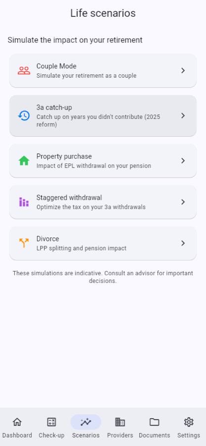
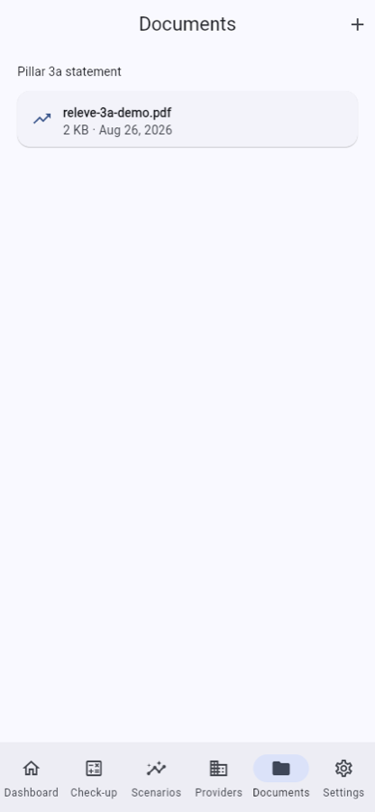
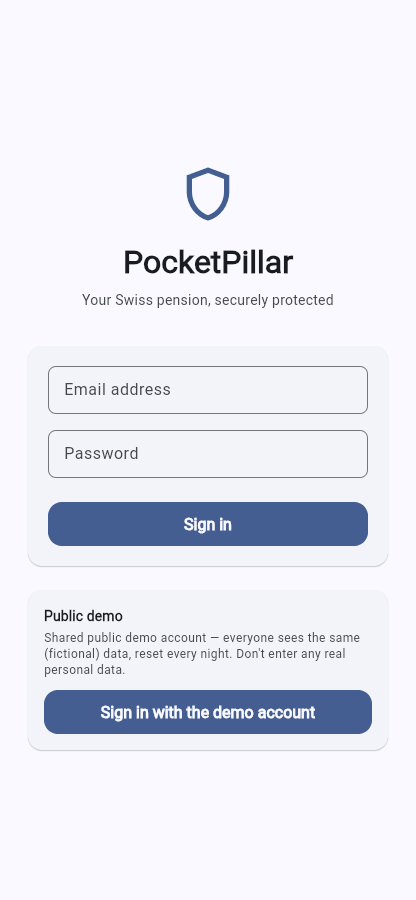

<p align="center">🇫🇷 <a href="README.fr.md"><strong>Version française disponible ici</strong></a></p>

<h1 align="center">🏛️ PocketPillar</h1>

<hr>

<p align="center"><strong>Swiss pension planning, finally clear.</strong> An independent 2nd & 3rd pillar optimizer — guided retirement check-up, real tax savings, life scenarios.</p>

<p align="center">▶ <a href="https://app.pocketpillar.ch"><strong>Try it live</strong></a> — nothing to install, no sign-up: tap “Sign in with the demo account”.</p>

<p align="center">Tax engine anchored to <strong>official Swiss FTA data</strong>, validated to the franc.<br>
Trilingual (French · German · English) — even server-computed labels follow <code>Accept-Language</code>.</p>

<p align="center">
  <a href="https://github.com/Lubachma/pocketpillar/actions/workflows/ci.yml"></a>
  <a href="https://github.com/Lubachma/pocketpillar/actions/workflows/codeql.yml"></a>
  <a href="LICENSE"></a>
</p>

<p align="center">
  
  
  
  
  
  
</p>

| Dashboard | Guided check-up | Scenarios | Documents |
|---|---|---|---|
|  |  |  |  |

<sub>Screenshots show the English UI; the demo account is shared and public — fictional data, reset nightly.</sub>

<p align="center">
  
</p>

## What it does

- **Full retirement projection** — AHV/AVS + occupational pension (BVG/LPP) + pillar 3a, replacement rate, year-by-year projection, PDF export.
- **3a tax savings** — real federal, cantonal, and communal tax rates for all 26 cantons.
- **Life scenarios** — couple simulation with a dated retirement timeline (full pension until the second retirement, then the AVS couple cap), staggered withdrawal, home purchase (EPL), divorce impact, retroactive 3a catch-up (Swiss reform — contribution gaps from 2025 onward).
- **Recommendations engine** — server-side rules, prioritized by estimated annual impact.
- **Provider comparison** — fees, performance, ESG, server-scored best match.
- **Document vault** — private storage (encrypted at rest), 5-minute signed download links.
- **Year-end checklist** — what to pay in before December 31.
- **Built-in pedagogy** — tap-anywhere help sheets (the 3 pillars, conversion rate, withdrawal tax…) and an in-app plain-words "how do we calculate?" page mirroring this repo's [methodology doc](docs/fiscal-accuracy.md).

## Swiss-grade accuracy

The tax engine is anchored to the **official calculator of the Swiss Federal
Tax Administration (FTA)**: cantonal income-tax tables sampled through 10,686
calls to the official API (26 cantons, single + married, interpolated on a
CHF 1,000 grid up to CHF 150,000, coarser above), real cantonal multipliers and real communal multipliers,
capital-withdrawal taxes from the official per-canton tables, and the official
2026 federal tax tariff. Validation anchors reproduce the official calculator
**to the franc** and are re-checkable with one command
(`node scripts/regen-cantonal-tax-tables.mjs --check`).

Method, legal parameters, documented approximations, and the annual update
process: **[docs/fiscal-accuracy.md](docs/fiscal-accuracy.md)**.

> PocketPillar provides information and indicative simulations — not
> investment advice within the meaning of the Swiss FinSA/LSFin.

## Architecture

```
Flutter app (iOS · Android · web/PWA)
  Riverpod · go_router · dio (JWT interceptor) · ARB i18n (fr/de/en)
        │  HTTPS + Supabase JWT
        ▼
Fastify 5 API (Fly.io) ── the single source of truth: no business
  │        │              calculation ever runs in the client
  │        ├─ PostgreSQL (Supabase) — data
  │        ├─ Supabase Auth + Storage — accounts, documents
  │        └─ Redis (Upstash) — JWT & premium cache
  └─ Prisma v7 (adapter-pg), Zod schemas, unified { error } format
```

Details: [docs/architecture.md](docs/architecture.md) ·
API reference: [docs/api-contract.md](docs/api-contract.md)

## Quality

- **422 backend tests** (Vitest) — calculation functions are pure and tested against official anchor values.
- **528 Flutter tests** (unit + widget) and mocked E2E journeys; `flutter analyze` at **0 issues**.
- CI on every push/PR to `main` (typecheck, lint, format, tests with coverage thresholds, debug APK build).
- Real-conditions smoke script against any deployment: `scripts/smoke-api.sh <base-url>` (7 steps, self-cleaning).
- The public demo is reset every night by a scheduled job that replays the real API end to end.

## Getting started

Prerequisites: Node.js ≥ 22, Docker (PostgreSQL + Redis), Flutter 3.44+.
The `make` convenience targets assume macOS; the plain `npm`/`flutter` commands work anywhere.

### Backend

```bash
cp .env.example .env         # configure environment variables
make setup                   # npm install + Docker + migrations + seed

make dev                     # dev server with hot reload
make check                   # typecheck + lint + format
npm test                     # Vitest suite
```

### Mobile (Flutter)

```bash
cd mobile
cp .env.example .env         # SUPABASE_URL + SUPABASE_ANON_KEY (public keys only)
flutter pub get && flutter gen-l10n

flutter run \
  --dart-define=API_BASE_URL=http://localhost:3000 \
  --dart-define-from-file=.env

flutter analyze && flutter test
```

See [mobile/README.md](mobile/README.md) for dart-defines, web/PWA build,
E2E tests, and platform notes. `make help` lists all backend commands.

## Monetization (dormant)

A complete freemium subscription stack is implemented — RevenueCat webhook,
premium gating (HTTP 402), paywall UI, purchase restoration — but deliberately
**dormant**: the public demo grants full access and no store accounts are
connected. It showcases the subscription architecture end to end.

## License

[PolyForm Noncommercial 1.0.0](LICENSE) — source-available; any commercial
use is reserved.
